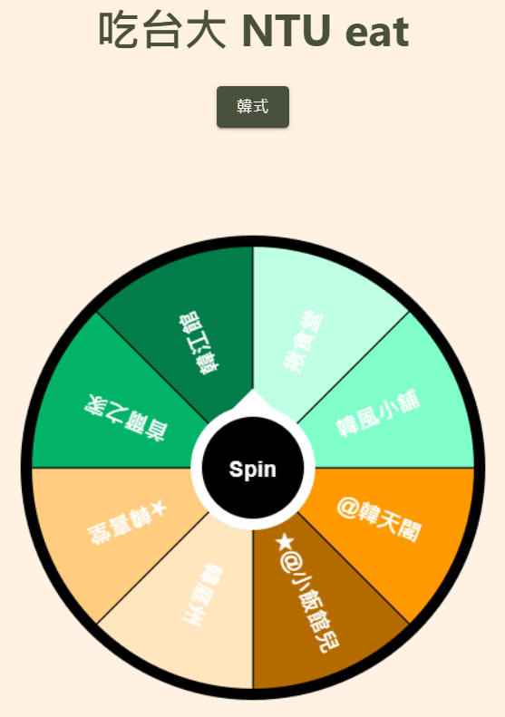

# NTU Wheel of dinner
A random restaurant picker for National Taiwan University built with ReactJS


## General usage
### Deployment
https://kaminyou.com/NTU-Dinner-Wheel/

### Restaurant list
Please revise the restaurants in the [google list](https://docs.google.com/spreadsheets/d/1JBg4qa6kiJcExqgJ5cDT8uylpQMO35BysL6n5233HLg/edit#gid=0), which is the subset of [吃台大2.0](https://docs.google.com/spreadsheets/d/1PWScTkQX4TG-9WE-mMsOnq3o5XRgX8x6z1BuVfM-a6Q/edit).

## Customize
A config file `src/config.json` is provided for you to customize your own wheel easily. Besides, deployment on [GitHub pages](https://pages.github.com/) can be achieved by simply executing `yarn deploy`.
1. Please fork this repo.
2. Please prepare a google sheet with a `sheet name` **in English** and record its `hash id` in the url. The google sheet url is in the following format: `https://docs.google.com/spreadsheets/d/<hash id>/`.
3. Modify `src/config.json`.
```json
{
    "TITLE": "<title>",
    "SPREADSHEET_ID": "<hash id>",
    "SHEET_NAME": "<sheet name (must be in Eng.)>",
    "UP_DURATION": 100,
    "DOWN_DURATION": 500,
    "COLOR_PALETTE": [
        "#ff9900", "#b36b00", "#ffe6bf", "#ffcc80", "#00b366", 
        "#007d48", "#bfffe4", "#80ffc9", "#400099", "#2d006b", 
        "#dabfff", "#b580ff"
    ]
}
```
- **TITLE**: The title of your wheel.
- **SPREADSHEET_ID**: The hash id of your google sheet.
- **SHEET_NAME**: The sheet name (must be in Eng.).
- **UP_DURATION**: In ms.
- **DOWN_DURATION**: In ms.
- **COLOR_PALETTE**: Append or remove color code (HEX) for the wheel.
4. Modify `homepage` in `package.json`.
```json
"homepage":<url>
```
4. Install all dependencies.
```
yarn install
```
5. Deploy
```
yarn deploy
```
